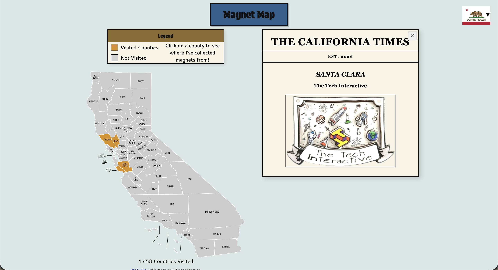
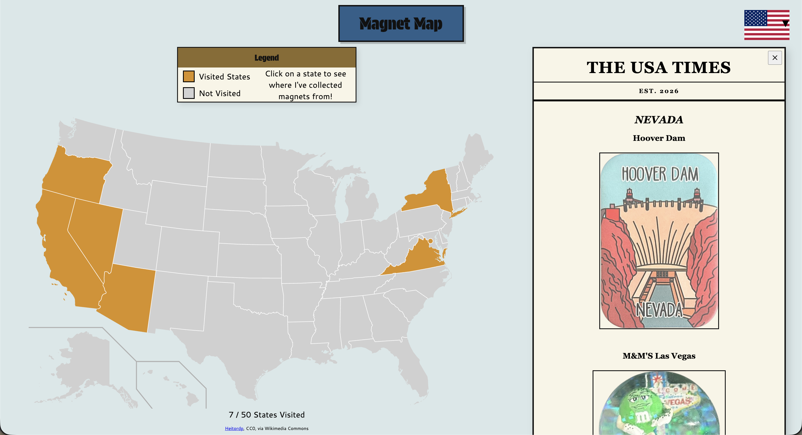
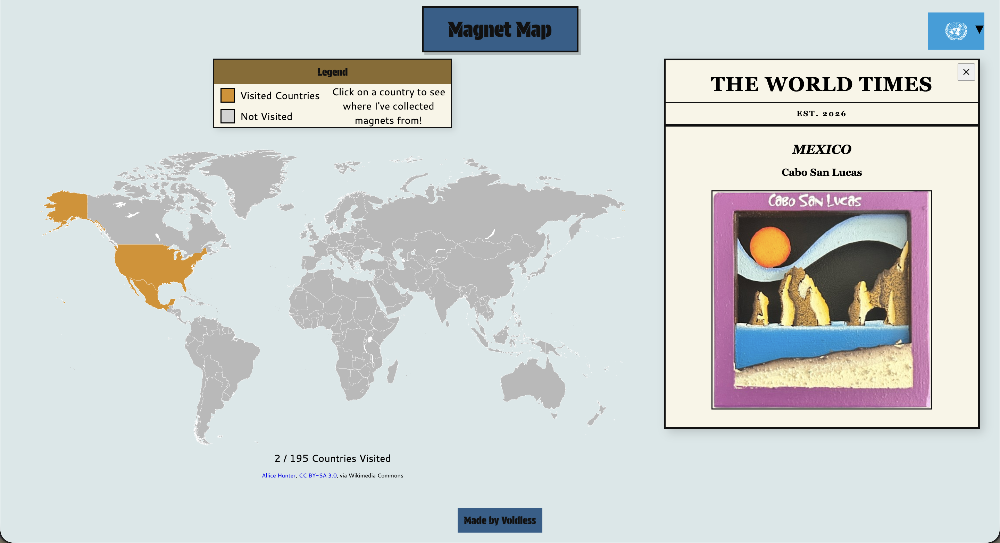

# Voidless's Magnet Map v2

A web based interactive map to showcase my magnet collection and the places I've visited.

Live Web App Link: https://voidlesspsycho.github.io/Magnet-Map/

## Features
- Interactive Map of California labeled with Counties
- Interactive Map of the United States with State Borders
- Interactive Map of the World with Country Borders
- Legend to explain colors on the map
- Popup Sidebar with Location Information and Pictures of Magnets
- Dropdown Menu to access all Map Modes

## How to Use
1. Click on regions colored orange in the map, as explained by the legend.
2. View information about locations I've been to within the region and images of magnets I've collected from each location.
3. Close the information in the newspaper-styled sidebar with the X button at the top right.
4. Access the other maps (California, USA, World) using the dropdown menu in the top right corner. 

## How it Works
1. The maps are SVG (Scalable Vector Graphic) files from Wikimedia. They are made up of polyline, path, and circle elements for each region. 
2. ID and Class attributes are used in conjuction with CSS to give visual feedback to hovering over a region.
3. Python is used to clean up SVG files to make it easier to parse and add data.
4. A JS Object stores information of each visited region, places visited within the region, and file paths for images of the magnets.
5. The SVG file is loaded through a fetch function in JavaScript.
6. The JS Script goes through all the counties (polylines/paths) and checks the object to see if the county has been visited. If it has been visited, the JS Script assigns a class to the county. Using CSS, the county can be colored orange.
7. When a county is clicked, a JS function is called to erase the existing text in the sidebar and replace it with information from the object about the selected county. 
8. The close button erases the text in the sidebar. 
9. The dropdown menu has flags, which link to the HTML files for the other maps.

## Tech Stack
- HTML5
- CSS
- JavaScript
- JSON (Data Storage)
- Python (Data Cleanup)
- GitHub Pages (Hosting)
- ChatGPT (Debugging/Planning)

## Motivation
I built this project because I always wanted a way to showcase my large magnet collection, and the current state of the project is just the beginning. I wanted a basic framework using the HTML, CSS, and JS skills I already have to make a small project to showcase my collection.

###### This project was made for Hack Club Horizons.