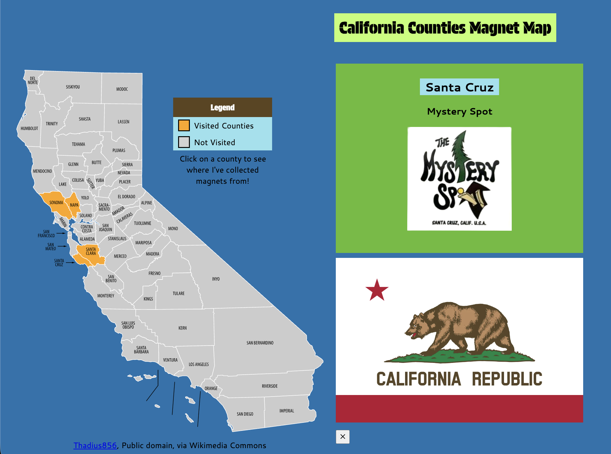

# Voidless's Magnet Map

A web based interactive map to showcase my magnet collection and the places I've visited.

## Features
- Clickable Map of California labeled with Counties
- Legend to explain colors on the map
- Popup Sidebar with Location information and picture of magnet
- Flag of the Greatest State in the Union
- Planned: Full USA and World Magnet Maps

## How to Use
1. Click on the title to scroll down to the map.
2. Click on Counties colored Orange on the map (~~Not Orange County Xp~~).
3. See a picture of my magnets and where I got them from in that county.
4. Close the Sidebar with the X button at the bottom of the sidebar.

## How it Works
1. The map of California is an SVG (Scalable Vector Graphic) file from Wikimedia. It is made up of polyline and path elements for each county that detect when the cursor is hovering over it or clicking the section of the map. 
2. A JS Object stores information of each visited county, places visited within the county, and file paths for images of the magnets.
3. The SVG file is loaded through a fetch function in JavaScript.
4. The JS Script goes through all the counties (polylines/paths) and checks the object to see if the county has been visited. If it has been visited, the JS Script assigns a class to the county. Using CSS, the county can be colored orange.
5. When a county is clicked, a JS function is called to erase the existing text in the sidebar and replace it with information from the object about the selected county. 
6. The close button erases the text in the sidebar. 

## Tech Stack
- HTML5
- CSS
- JavaScript
- GitHub Pages (Hosting)
- ChatGPT (Only Minor Use)

## Motivation
I built this project because I always wanted a way to showcase my large magnet collection, and the current state of the project is just the beginning. I wanted a basic framework using the HTML, CSS, and JS skills I already have to make a small project to showcase my collection. I will continue to expand the project in the future into a true display case for all my travels.

###### This project was made for Hack Club Horizons.